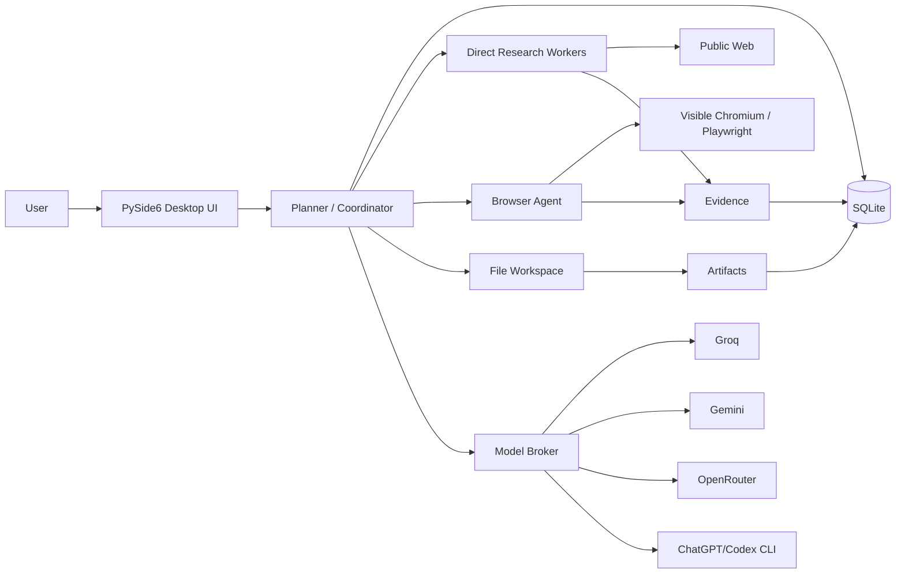

# WebAgent

> **An open-source, visible-browser AI agent for Windows — persistent chats, deep research, real Chromium automation, human takeover, artifacts, evidence, and multi-provider routing.**


WebAgent is a desktop AI agent that can **plan a goal, research the web, drive a visible Chromium browser, collect evidence, create files, remember the current chat, and hand control back to you when a human needs to step in**.

It is built for people who want an agent they can actually *watch* work.

**Current release: `v0.3.9.4`**

> [!IMPORTANT]
> WebAgent is an independent open-source project. It is **not affiliated with, endorsed by, or derived from Meta Muse**. The project uses “Muse-like” below only to describe familiar product interaction patterns such as conversational tasking, a visible browser, persistent context, and human takeover.

---

## Why WebAgent?

Most browser-agent demos hide the interesting part behind a spinner. WebAgent is intentionally different:

- **Visible work** — Chromium stays visible while the agent browses.
- **Human-in-the-loop** — pause/take control whenever you want.
- **Persistent chats** — reopen a chat and continue with its messages, tasks, sources, and files.
- **Real research plans** — complex goals become a persistent task graph instead of one giant prompt.
- **Evidence-first synthesis** — research results are grounded in stored sources and artifacts.
- **Actual deliverables** — the agent can create Markdown, text, JSON, CSV, DOCX, XLSX, PDF, and other text-based artifacts.
- **Multi-provider routing** — use Groq, Gemini, OpenRouter, or an existing authenticated ChatGPT/Codex CLI setup.
- **Free-model safeguards** — provider discovery and execution enforce the project's free-only policy where implemented.
- **Verification handoff** — CAPTCHA/human-verification challenges are never bypassed; automation pauses and waits for you.
- **Diagnostics you can inspect** — per-run logs and a redacted diagnostic ZIP make failures easier to understand.

If this project saves you time, **star the repo**. It helps more people find it. ⭐

---

## Muse-like experience, open-source implementation

WebAgent includes several interaction patterns people associate with modern personal agents such as Muse, but implements them locally in its own desktop architecture.

| Experience | WebAgent implementation |
| --- | --- |
| Conversational tasking | Persistent chat UI with same-chat conversational context |
| Agent uses a real browser | Visible persistent Chromium controlled with Playwright |
| Watch the agent work | Live browser activity plus task/activity panels |
| Take over the browser | **Pause / Take Control** leaves Chromium available for direct user interaction |
| Hand work back to the agent | Resume after manual interaction; verification handoff can resume automatically |
| Long-running multi-step work | Planner creates a task DAG with dependencies and verification |
| Research across multiple sources | Direct web research plus browser escalation and parallel independent research branches |
| Persistent context | Messages, tasks, evidence, activity, artifacts, and bounded conversational memory are stored per chat |
| Files/results | Agent workspace with TXT/Markdown, JSON, CSV, DOCX, XLSX, and PDF creation |
| Safety around sensitive steps | Consequential final actions stop for human approval/manual completion |
| Human verification | CAPTCHA/anti-bot challenges pause automation instead of being solved or bypassed |
| See where answers came from | Sources/evidence panel and persisted evidence used for final synthesis |

### What WebAgent does **not** claim to be

WebAgent is not a Muse clone, does not use Meta's code, and does not attempt to reproduce private/proprietary implementation details. It also does not currently provide the same cloud integrations, mobile experience, secure VM architecture, or account ecosystem that commercial personal agents may offer.

---

## Feature highlights

### 🧠 Planner → executor → verifier → replanner

For complex goals, WebAgent can generate and persist a task graph, execute independent branches, verify success criteria, and continue from the resulting evidence.

Research depth presets:

- **Quick** — lightweight work with fewer steps.
- **Standard** — balanced planning/research.
- **Deep** — more thorough research and artifact-oriented workflows.

### 🌐 Visible browser automation

The browser layer supports semantic actions such as:

- navigate and search
- click
- type
- press keys
- scroll
- go back
- open, switch, and close tabs
- inspect the current page

Recent reliability work adds:

- stale-element recovery
- modal/overlay recovery
- slow-navigation handling
- browser-action JSON repair
- action-schema validation/repair
- viewport-aware observations and scrolling
- preservation of useful comparison tabs

### 🙋 Human verification handoff

When WebAgent detects a visible CAPTCHA or human-verification challenge, it:

1. pauses model/browser actions;
2. brings the controlled Chromium page forward;
3. shows a persistent banner in the app;
4. waits while **you** complete the challenge;
5. polls for a clean page state; and
6. resumes only after three consecutive challenge-free observations.

WebAgent **does not solve, evade, or bypass CAPTCHA/anti-bot systems**.

### 💬 Persistent chats and conversational memory

Each chat can retain:

- user/assistant messages
- tasks and task state
- activity history
- evidence/sources
- artifacts/files
- recent same-chat conversational context

The conversational memory window is bounded to recent turns. Current user instructions remain authoritative, and memory is not shared across chats.

### 📚 Evidence-grounded research

Research can use fast public-web collection and escalate to the visible browser for blocked, interactive, or JavaScript-heavy pages.

Reliability protections include:

- evidence aggregation across parent/child task lineage
- actual success-criteria verification
- fail-closed final synthesis when no evidence was recorded
- direct-search fallback across DuckDuckGo and Bing adapters
- browser escalation when direct research is insufficient

### 📄 File creation and workspace

The configured working folder defaults to:

```text
C:\Users\<you>\Documents\WebAgent Workspace
```

Each chat gets a numbered folder:

```text
chat-000001\
chat-000002\
shared\
```

Example artifacts:

```text
chat-000001\research-report.docx
chat-000001\vehicle-comparison.xlsx
chat-000001\sources.md
shared\reference-notes.md
```

The agent's file tools are restricted to the configured workspace root.

### 🔀 Provider routing

Supported provider paths in this release:

- **Groq**
- **Gemini**
- **OpenRouter**
- **ChatGPT/Codex CLI** discovered from the existing AgentSmith/GroqVM WSL environment

Routing modes:

| Mode | Behavior |
| --- | --- |
| **Manual** | Strict selected model/provider behavior; alternate keys for the same provider/model may still be used |
| **Hybrid** | Honors role preferences, then allows fallback |
| **Automatic** | Full eligible provider/model/key fallback |

The provider manager includes live model discovery, key fingerprints rather than raw-key display, cooldown/health tracking, rate-limit handling, and persistent OpenRouter quota safeguards.

---

## Architecture



The app is standalone: it does **not** import or reuse AgentSmith's agent, browser, UI, prompts, executor, or database. The current provider bridge reads an existing AgentSmith/GroqVM WSL configuration and credentials at runtime.

---

## Requirements

Current release target:

- **Windows 10/11**
- **Python 3.10+**
- PowerShell
- Playwright Chromium (installed automatically by the setup script)
- For provider access in the current build: an existing **AgentSmith/GroqVM WSL environment** containing provider configuration/API keys and/or an authenticated ChatGPT/Codex CLI

> [!NOTE]
> WebAgent can start when AgentSmith/GroqVM discovery fails, but provider access may be unavailable. A future goal is fully standalone credential/provider configuration.

---

## Quick start

### Option 1 — easiest

Clone or download the repository, then double-click:

```text
run.bat
```

On first run, WebAgent invokes the installer automatically.

### Option 2 — PowerShell

```powershell
scripts\install-and-run.ps1
```

The installer will:

1. create `.venv`;
2. upgrade `pip`;
3. install `requirements.txt`;
4. install Playwright Chromium; and
5. launch WebAgent.

### Option 3 — manual development setup

```powershell
py -3 -m venv .venv
.\.venv\Scripts\Activate.ps1
python -m pip install --upgrade pip
python -m pip install -r requirements.txt
python -m playwright install chromium
python -m webagent.app
```

---

## Typical workflow

1. Open WebAgent.
2. Create a new chat.
3. Pick **Quick**, **Standard**, or **Deep** research.
4. Choose Automatic, Hybrid, or Manual routing.
5. Describe the goal in normal language.
6. Watch the task plan and visible browser activity.
7. Use **Pause / Take Control** whenever direct input is needed.
8. Open generated files from the Files panel and evidence pages from Sources.

Example goals:

```text
Research three laptops under my budget, compare battery life and ports,
and create an XLSX with the finalists plus a short recommendation.
```

```text
Find the strongest sources on this topic, summarize the competing claims,
and create a cited Markdown research brief.
```

```text
Navigate this site until the final irreversible submission step,
then stop and let me review it.
```

---

## Safety boundaries

WebAgent is designed to keep a human in control of consequential actions.

The agent prompt instructs the browser loop **not** to perform the final step of actions such as:

- purchases
- bids
- sending messages
- deleting data
- legal/government submissions
- other irreversible or consequential final actions

It should stop before that final action and require user approval/manual completion.

Human-verification challenges are also explicitly outside the autonomous model loop.

> [!WARNING]
> Browser automation and LLMs can make mistakes. Review important actions, generated files, and research before relying on them.

---

## Privacy and local data

Application state is stored under `%LOCALAPPDATA%\WebAgent`, including the local SQLite database, browser profile, diagnostics, downloads, and shared quota state.

The configured workspace defaults to your Documents folder.

Security/reliability choices in the current build include:

- raw API keys are not written into WebAgent's normal config;
- UI key management uses stable key fingerprints;
- diagnostics redact secrets;
- OpenRouter usage tracking stores a SHA-256 key fingerprint rather than raw keys;
- file tools are restricted to the configured workspace root.

See [SECURITY.md](SECURITY.md) for reporting guidance.

---

## Diagnostics

WebAgent writes per-run diagnostics in both machine-readable and human-readable formats:

```text
<run-id>.jsonl
<run-id>.log
```

A diagnostic ZIP can include:

- redacted logs
- a database snapshot
- redacted configuration

This is useful for bug reports without intentionally bundling raw API keys.

---

## Run the tests

```powershell
python -m pytest -q
```

Current repository result:

```text
39 passed
```

GitHub Actions also runs the unit test suite on pushes and pull requests.

---

## Repository map

```text
webagent/
  agent/          planner, browser loop, v3 coordinator
  browser/        Playwright browser manager
  files/          workspace and artifact tools
  integrations/   AgentSmith/GroqVM compatibility bridge
  memory/         SQLite persistence
  providers/      providers, routing, quotas, rate limits
  ui/             PySide6 desktop UI

tests/            regression/unit tests
scripts/          install/run helpers
```

Important docs:

- [DESIGN-ROADMAP.md](DESIGN-ROADMAP.md)
- [V0.3-IMPLEMENTATION.md](V0.3-IMPLEMENTATION.md)
- [V0.3.1-RELIABILITY-FIXES.md](V0.3.1-RELIABILITY-FIXES.md)
- [V0.3.2-RATE-LIMITS.md](V0.3.2-RATE-LIMITS.md)
- [V0.3.3-PROVIDER-MANAGEMENT.md](V0.3.3-PROVIDER-MANAGEMENT.md)
- [V0.3.4-FREE-MODELS-AND-QUOTA-SAFETY.md](V0.3.4-FREE-MODELS-AND-QUOTA-SAFETY.md)
- [V0.3.5-BROWSER-RESEARCH-RELIABILITY.md](V0.3.5-BROWSER-RESEARCH-RELIABILITY.md)
- [V0.3.6-MANUAL-ROUTING-AND-PROVIDER-FIXES.md](V0.3.6-MANUAL-ROUTING-AND-PROVIDER-FIXES.md)
- [V0.3.7-TRUE-MANUAL-MODE.md](V0.3.7-TRUE-MANUAL-MODE.md)
- [V0.3.8-BROWSER-REGRESSION-RESTORE.md](V0.3.8-BROWSER-REGRESSION-RESTORE.md)
- [V0.3.9-JSON-REPAIR.md](V0.3.9-JSON-REPAIR.md)
- [V0.3.9.1-ACTIVITY-AUTOSCROLL.md](V0.3.9.1-ACTIVITY-AUTOSCROLL.md)
- [V0.3.9.2-VIEWPORT-AWARE-SCROLLING.md](V0.3.9.2-VIEWPORT-AWARE-SCROLLING.md)
- [V0.3.9.3-ACTION-SCHEMA-HOTFIX.md](V0.3.9.3-ACTION-SCHEMA-HOTFIX.md)
- [V0.3.9.3-CONVERSATIONAL-MEMORY.md](V0.3.9.3-CONVERSATIONAL-MEMORY.md)
- [V0.3.9.4-HUMAN-VERIFICATION-HANDOFF.md](V0.3.9.4-HUMAN-VERIFICATION-HANDOFF.md)
- [CHANGELOG.md](CHANGELOG.md)

---

## Roadmap

The existing roadmap points toward:

- richer user-file import
- PDF/DOCX/XLSX research inputs
- improved spreadsheet/report formatting
- download management
- reusable workflows
- stronger resume/recovery behavior
- more explicit consequential-action approvals
- more standalone provider configuration

Issues and pull requests for well-scoped improvements are welcome.

---

## Contributing

See [CONTRIBUTING.md](CONTRIBUTING.md).

Useful contribution areas include browser reliability, accessibility-based interaction, provider adapters, artifact quality, tests, UI polish, documentation, and safety controls.

Please never commit API keys, browser profiles, diagnostic bundles containing private data, or other secrets.

---

## License

**MIT License.** Free to use, modify, distribute, and build on — including commercially — subject to the MIT license notice.

See [LICENSE](LICENSE).

---

## Help this project grow

If WebAgent is useful to you:

- ⭐ **Star the repository**
- 🍴 Fork it and experiment
- 🐛 Open reproducible bug reports
- 💡 Propose focused features
- 🧪 Add regression tests
- 📣 Share demos, screenshots, and workflows you build with it

**Build agents people can see, understand, and take control of.**
